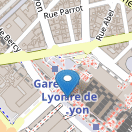

# AngularLeafletExample

Example of how to use [Leaflet](http://leafletjs.com/) and [Leaflet.SmoothMarkerBouncing](https://github.com/hosuaby/Leaflet.SmoothMarkerBouncing)
plugin in Angular application.

    

## Demo

Check out the [demo](https://hosuaby.github.io/angular-leaflet-example/).
